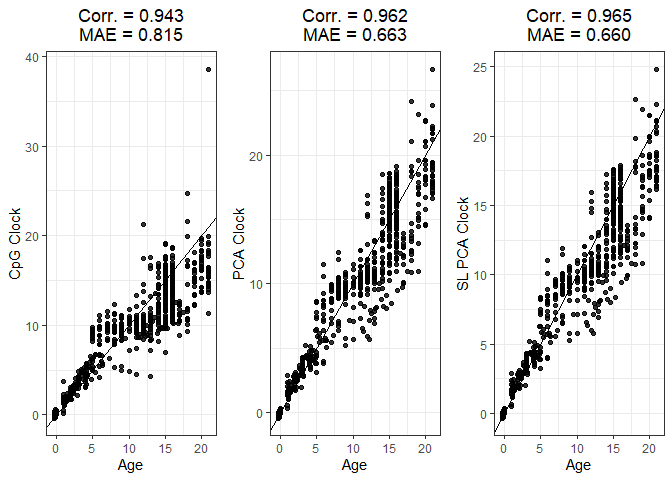

SLPCA Predictor Development Guide
================

## Background

  DNA methylation is commonly measured with Illumina microarrays, for
example the 450K and EPIC microarrays, which provide highly reproducible
means of characterizing DNA methylation across the epigenome. However,
the reliability of individual CpG sites can be influenced by several
factors including batch effects, variability within individual sites,
and array type differences. This limited reliability of individual CpG
sites can become a key issue in epigenetic clocks and other DNA
methylation-derived predictors which often use only a small subset of
CpG sites, usually ranging from a few dozen to a few hundred, to predict
a trait. Recently, Higgens-Chen et al proposed training epigenetic
clocks on the principal components generated from CpG-level data to
overcome the limitations of relying on individual CpG sites. The PCA
clocks were found to improve agreement between replicate samples,
improve the detection of clock associations, and better enable the study
of longitudinal trajectories of epigenetic aging compared to CpG-trained
clocks. However, the substantial data reduction conferred by the
principal component analysis of DNA methylation data may also enable the
implementation of more advanced machine learning methodology. One
popular modern machine learning methodology is SuperLearner, which is an
algorithm that uses cross validation to evaluate the performance of
multiple candidate algorithms and create an ensemble model consisting of
a weighted combination of the individual candidate algorithms.  
  Here, we present an efficient methodology for simultaneously training
epigenetic clocks using three methodologies:

-   1)  CpG Clock: based on elastic net regression of the CpG matrix  

-   2)  PCA Clock: Principal component analysis followed by elastic net
        regression of the PC matrix  

-   3)  SL PCA Clock: SuperLearner ensemble predictor based on the PC
        matrix


User guide for using the SuperLearner PCA pipeline to generate
DNAm-based predictors and generate predictions on new datasets.

-   Step 1 involves training a new clock.  
-   Step 2 involves generating predictions using the clocks.  
-   Step 3 involves generating basic summary statistics

# Step 1) Training Process

## Load Packages

Primary packages and source functions required for both training and
testing processes. Install packages as necessary.

``` r
library(tidyverse)
library(haven)
library(glmnet)
library(caret)
library(MASS)   
library(SuperLearner)
library(biglasso)
library(randomForest)
library(earth)
library(Metrics)
library(arm)
library(pROC)
```

Load SL PCA Functions from GitHub. (Update with github link)

``` r
source("C:/Users/Dennis/Desktop/SL_PCA_Clock_Functions.R") 
```

## Load Data

The training function requires no missing data in either the DNA
methylation or phenotype datasets. Perform imputation or complete case
subsetting prior to analysis as necessary. The prediction function
accepts missing data and performs a basic mean imputation.

``` r
# loading 2 files, datMethTrain (methylation matrix) and datPhenoTrain (phenotype and ID dataset)
load("panChildhood_training.RData")
head(rownames(datMethTrain)) # rownames should be sample IDs
```

    ## [1] "GSM796666" "GSM796667" "GSM796668" "GSM796669" "GSM796670" "GSM796671"

``` r
head(colnames(datMethTrain)) #colnames should be Illumina probeIDs (eg. cg04195702)
```

    ## [1] "cg00000029" "cg00000109" "cg00000165" "cg00000289" "cg00000363"
    ## [6] "cg00000622"

``` r
# row order of methylation data and row order of phenotype file should be matched
identical(rownames(datMethTrain), datPhenoTrain$geo_accession)
```

    ## [1] TRUE

``` r
head(datPhenoTrain$Age) # Age column from phenotype file, should have age in years as a numeric
```

    ## [1]  3.5 13.5 14.0 15.0 16.5 17.0

## Training Function

**meth**: methylation matrix described above  
**pheno**: phenotype vector or column from a dataframe/matrix  
**trim_length**: how many of the lowest variance explained PCs to trim
prior to running models. Can start with lower trim lengths and increase
as necessary if low variance principal components are having undue
influence on the predictions. Must match trim_length in both training
and prediction functions  
**sl_library**: Library of algorithms for the SuperLearner. SL.glmnetXX
algorithms are pre-specified glmnets with alpha parameters set to 0.XX.
View [SuperLearner
guide](https://cran.r-project.org/web/packages/SuperLearner/vignettes/Guide-to-SuperLearner.html)
for more details on available models and additional SuperLearner
specifications. Highly data adaptive algorithms can lead to substantial
overfitting. When predicting variables other than age, including
“c(”SL.gam”, “screen.glmnet”)” and “SL.randomForest” may improve
performance. Custom algorithms not included in the SuperLearner package
can be added following the “SL.template” provided in the package.  
**family_type**: gaussian and binomial families currently supported.  
**save_data**: set to true if you wish to save individual clock outputs
while running function, use cpg_clock, pca_clock, sl_pca_clock to set
names for the cpg, pca, and sl pca clock outputs respectively

``` r
# library specifications
library_ex1 <- list("SL.mean", 
    c("SL.glm", "screen.glmnet"), "SL.glm", 
    "SL.glmnet0", "SL.glmnet05", "SL.glmnet10", 
    "SL.glmnet25", "SL.glmnet40", "SL.glmnet50",  
    "SL.glmnet60", "SL.glmnet75", 
    "SL.glmnet90")

# training function
### Should print messages indicating what stage of the prediction process the function is on
all <- train_all_clocks(meth = datMethTrain, pheno = datPhenoTrain$Age, trim_length = 15, 
                             sl_library = library_ex1, family_type = "gaussian",
                       save_data = FALSE)


save(all, file = "Childhood_Clock_Inputs.RData") # save full object and load later
```

``` r
load("Childhood_Clock_Inputs.RData") # keep in mind this can be a large file 

# extract instructions for each individual clock 
cpg_input <- all$CpG_Clock   # CpG Clock
pca_input <- all$PCA_Clock   # PCA Clock
sl_input <- all$SL_PCA_Clock # SL PCA Clock
sl_input[[1]] # can examine coefficients given to each input model from the SuperLearner
```

    ## 
    ## Call:  
    ## SuperLearner(Y = pheno, X = TrainPCData, family = family_type, SL.library = sl_library) 
    ## 
    ## 
    ## 
    ##                              Risk         Coef
    ## SL.mean_All          1.654229e+00 0.000000e+00
    ## SL.glm_screen.glmnet 1.033918e-01 6.448999e-02
    ## SL.glm_All           3.187070e+05 2.092854e-05
    ## SL.glmnet0_All       1.654404e+00 0.000000e+00
    ## SL.glmnet05_All      1.231108e-01 0.000000e+00
    ## SL.glmnet10_All      8.159706e-02 3.791394e-01
    ## SL.glmnet25_All      7.416735e-02 5.563497e-01
    ## SL.glmnet40_All      7.590071e-02 0.000000e+00
    ## SL.glmnet50_All      7.723674e-02 0.000000e+00
    ## SL.glmnet60_All      7.769242e-02 0.000000e+00
    ## SL.glmnet75_All      7.948851e-02 0.000000e+00
    ## SL.glmnet90_All      8.019741e-02 0.000000e+00

# Step 2) Predictions

## Prediction Function

**cpg_coefs**: cpg model input from above  
**pca_model**: pca model input from above  
**pca_sl_model**: pca_sl model input from above  
**age_transform**: Transformation to apply to predictions. Set to
“Horvath” only when running childhood clock predictions. Set to “None”
in other cases to return original predictions.

``` r
# predicts ages from all 3 clocks
### clock inputs set to names from childhood clock training data 
all_predictions <- predict_all_clocks(cpg_coefs = cpg_input, pca_model = pca_input, 
                               pca_sl_model = sl_input, meth = datMethTrain, 
                        trim_length=15, age_transform = "Horvath")  

head(all_predictions) # dataset containing predictions from all 3 clocks for all samples
```

    ##           CpG_Clock PCA_Clock PCA_SL_Clock
    ## GSM796666  5.043033  5.225551     5.188525
    ## GSM796667 10.835547  9.607157     9.428362
    ## GSM796668 11.427971  9.675165     9.569679
    ## GSM796669 11.096052 10.803615    10.606326
    ## GSM796670 12.569892 12.358874    12.132453
    ## GSM796671 12.188951 10.046951     9.954111

``` r
# join with phenotype data containing actual chronological ages
# make sure row order of phenotype file matches row order from the methylation file
### if it was not matched, can alternatively join by rownames
dat <- cbind(datPhenoTrain, all_predictions)

#save(dat, file = "Predictions_Training.RData") # save prediction phenotype file
```

# Step 3) Clock Fit Summaries

comp_plot function returns a basic correlation plot, with summary
statistics on median absolute error and pearson correlation
coefficients.

``` r
library(tidyverse)
library(Metrics)
library(gridExtra)

load("Predictions_Training.RData") # predictions from earlier

a <- comp_plot(dat$Age, dat$CpG_Clock, x_lab="Age", y_lab="CpG Clock")
b <- comp_plot(dat$Age, dat$PCA_Clock, x_lab="Age", y_lab="PCA Clock")
c <- comp_plot(dat$Age, dat$PCA_SL_Clock, x_lab="Age", y_lab="SL PCA Clock")

grid.arrange(a,b,c, nrow=1)
```

<!-- -->
